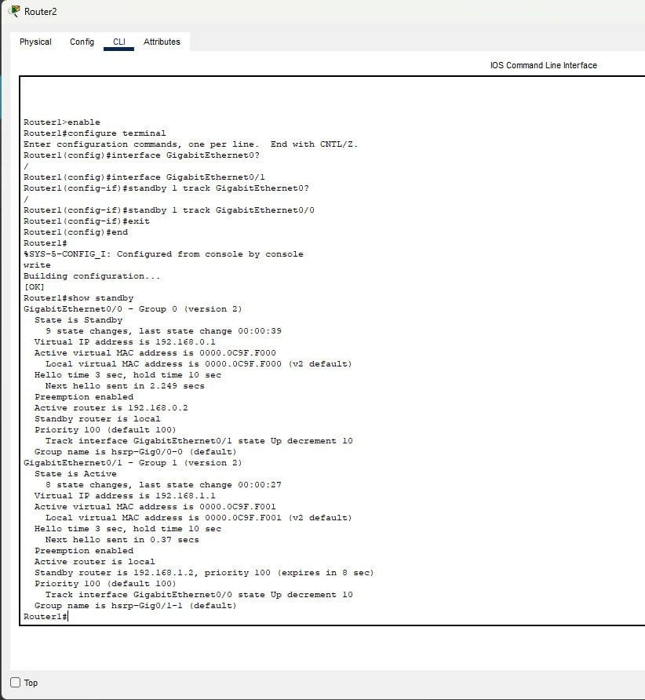
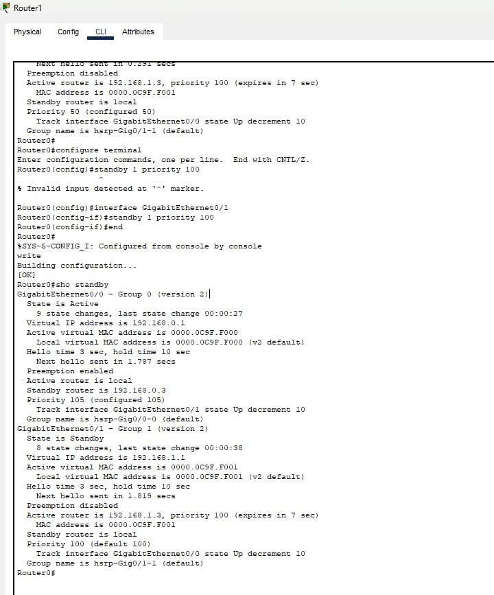
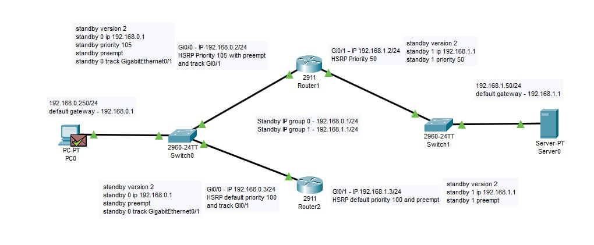
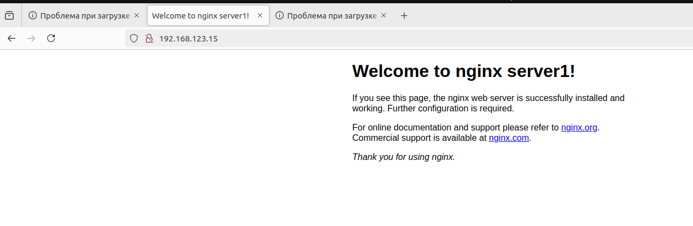
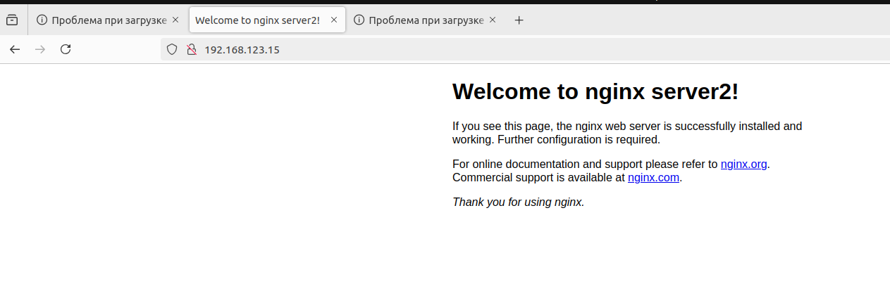

# Домашнее задание к занятию 1 «Disaster recovery и Keepalived»

### Задание 1
- Дана [схема](1/hsrp_advanced.pkt) для Cisco Packet Tracer, рассматриваемая в лекции.
- На данной схеме уже настроено отслеживание интерфейсов маршрутизаторов Gi0/1 (для нулевой группы)
- Необходимо аналогично настроить отслеживание состояния интерфейсов Gi0/0 (для первой группы).
- Для проверки корректности настройки, разорвите один из кабелей между одним из маршрутизаторов и Switch0 и запустите ping между PC0 и Server0.
- На проверку отправьте получившуюся схему в формате pkt и скриншот, где виден процесс настройки маршрутизатора.

### Решение:
1. Router 1:


2. Router 2:

3. test ping 192.168.1.50

4. [PKT file](disasterRecoveryHW.pkt)

------


### Задание 2
- Запустите две виртуальные машины Linux, установите и настройте сервис Keepalived как в лекции, используя пример конфигурационного [файла](1/keepalived-simple.conf).
- Настройте любой веб-сервер (например, nginx или simple python server) на двух виртуальных машинах
- Напишите Bash-скрипт, который будет проверять доступность порта данного веб-сервера и существование файла index.html в root-директории данного веб-сервера.
- Настройте Keepalived так, чтобы он запускал данный скрипт каждые 3 секунды и переносил виртуальный IP на другой сервер, если bash-скрипт завершался с кодом, отличным от нуля (то есть порт веб-сервера был недоступен или отсутствовал index.html). Используйте для этого секцию vrrp_script
- На проверку отправьте получившейся bash-скрипт и конфигурационный файл keepalived, а также скриншот с демонстрацией переезда плавающего ip на другой сервер в случае недоступности порта или файла index.html

### Решение:
1. установил nginx на 2 виртуальные машины и keepalived
2. script and conf vm1
```ini
  GNU nano 6.2                                                                        keepalived.conf                                                                                  
global_defs {
    script_user root
    enable_script_security
}

vrrp_script chk_webserver {
    script "/etc/keepalived/script.sh"
    interval 3
}

vrrp_instance VI_1 {
    state MASTER
    interface enp0s9
    virtual_router_id 15
    priority 255
    advert_int 1

    # Виртуальный IP-адрес
    virtual_ipaddress {
        192.168.123.15/24
    }

    # Отслеживание состояния веб-сервера через скрипт
    track_script {
        chk_webserver
    }
}

```
```bash
  GNU nano 6.2                                                                           script.sh                                                                                     
#!/bin/bash

# Проверка, слушает ли порт 80
if [[ $(ss -lntup | grep LISTEN | grep ':80') ]] && [[ -f /var/www/html/index.html ]]; then
    # Проверка доступности HTTP сервера по URL http://192.168.123.7
    curl -s --head http://192.168.123.7:80 | head -n 1 | grep "200 OK" > /dev/null
    if [ $? -eq 0 ]; then
        exit 0  # Если проверка прошла успешно, выходим с кодом 0
    else
        echo "HTTP check failed: Server did not return 200 OK"  # Ошибка при получении ответа от сервера
        exit 1  # Завершаем скрипт с ошибкой
    fi
else
    echo "Failed: Port 80 not open or index.html file missing"  # Ошибка при проверке порта или файла
    exit 1  # Завершаем скрипт с ошибкой
fi
```
3. script and conf vm2
```ini
global_defs {
    script_user root
    enable_script_security
}

vrrp_script chk_webserver {
    script "/etc/keepalived/script.sh"
    interval 3
}


vrrp_instance VI_1 {
    state BACKUP
    interface enp0s9
    virtual_router_id 15
    priority 100
    advert_int 1

    virtual_ipaddress {
        192.168.123.15/24
    }
    track_script {
        chk_webserver
    }
}

```
```bash
#!/bin/bash

# Проверка, слушает ли порт 80
if [[ $(ss -lntup | grep LISTEN | grep ':80') ]] && [[ -f /var/www/html/index.html ]]; then
    # Проверка доступности HTTP сервера по URL http://192.168.123.7
    curl -s --head http://192.168.123.7:80 | head -n 1 | grep "200 OK" > /dev/null
    if [ $? -eq 0 ]; then
        exit 0  # Если проверка прошла успешно, выходим с кодом 0
    else
        echo "HTTP check failed: Server did not return 200 OK"  # Ошибка при получении ответа от сервера
    fi
else
    echo "Failed: Port 80 not open or index.html file missing"  # Ошибка при проверке порта или файла
fi

# Скрипт всегда завершится с кодом 0 чтобы keepalived не падал на второй машине
exit 0
```

4. test - nginx work on vm1: (response from server1)

5. test - nginx down on vm1: (we can see response from server2)



------

## Дополнительные задания со звёздочкой*

Эти задания дополнительные. Их можно не выполнять. На зачёт это не повлияет. Вы можете их выполнить, если хотите глубже разобраться в материале.
 
### Задание 3*
- Изучите дополнительно возможность Keepalived, которая называется vrrp_track_file
- Напишите bash-скрипт, который будет менять приоритет внутри файла в зависимости от нагрузки на виртуальную машину (можно разместить данный скрипт в cron и запускать каждую минуту). Рассчитывать приоритет можно, например, на основании Load average.
- Настройте Keepalived на отслеживание данного файла.
- Нагрузите одну из виртуальных машин, которая находится в состоянии MASTER и имеет активный виртуальный IP и проверьте, чтобы через некоторое время она перешла в состояние SLAVE из-за высокой нагрузки и виртуальный IP переехал на другой, менее нагруженный сервер.
- Попробуйте выполнить настройку keepalived на третьем сервере и скорректировать при необходимости формулу так, чтобы плавающий ip адрес всегда был прикреплен к серверу, имеющему наименьшую нагрузку.
- На проверку отправьте получившийся bash-скрипт и конфигурационный файл keepalived, а также скриншоты логов keepalived с серверов при разных нагрузках


------

### Правила приема работы

1. Необходимо следовать инструкции по выполнению домашнего задания, используя для оформления репозиторий Github
2. В ответе необходимо прикладывать требуемые материалы - скриншоты, конфигурационные файлы, скрипты. Необходимые материалы для получения зачета указаны в каждом задании.


------

### Критерии оценки

- Зачет - выполнены все задания, ответы даны в развернутой форме, приложены требуемые скриншоты, конфигурационные файлы, скрипты. В выполненных заданиях нет противоречий и нарушения логики
- На доработку - задание выполнено частично или не выполнено, в логике выполнения заданий есть противоречия, существенные недостатки, приложены не все требуемые материалы.